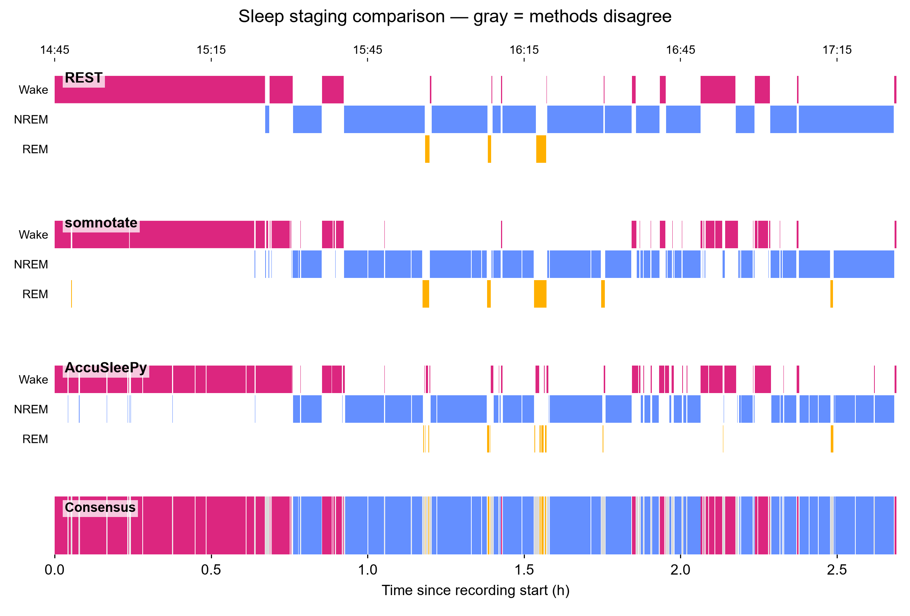
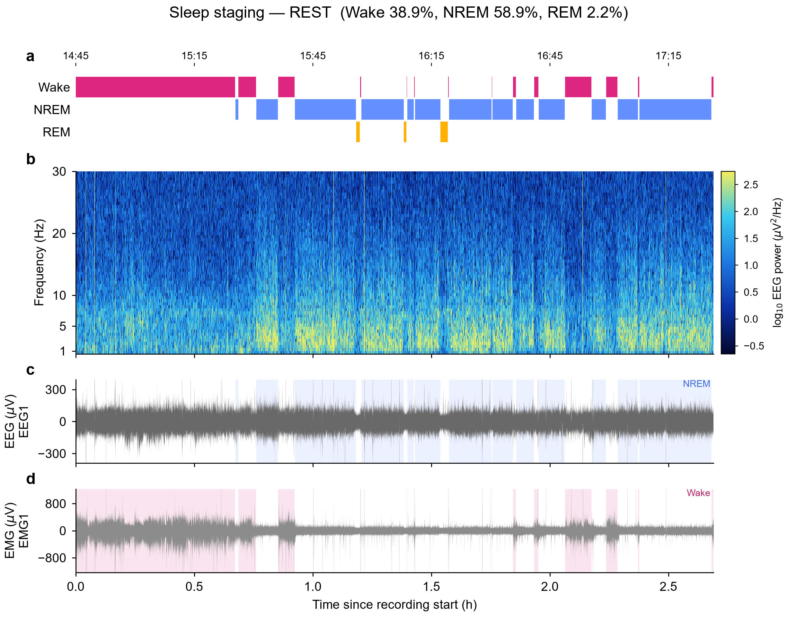

# Mouse Sleep Staging Pipeline

End-to-end pipeline that scores mouse EEG/EMG recordings with **three open-source
sleep-staging methods**, starting from raw Intan files, and produces the
comparison statistics and publication-ready figures in one go.

```
Intan DAT (int16, 30 kHz, one file per channel)
   →  0.195 µV/bit conversion  →  chunked anti-aliased decimation to 1 kHz
   →  50/100 Hz notch  →  EDF / parquet
   →  REST  ·  somnotate  ·  AccuSleePy      (4 s epochs, Wake / NREM / REM)
   →  alignment, statistics, figures
```

## The three methods

| # | Method | Principle | Input | Output |
|---|--------|-----------|-------|--------|
| 1 | [**REST**](https://github.com/SukiyakiP/REST) | Pre-trained Transformer (no training needed, GPU inference) | EDF (EEG channel name contains `RF` + an `EMG` channel) | `.mat`, one score per 4 s epoch (1=Wake 2=NREM 3=REM 4=Artifact) |
| 2 | [**somnotate**](https://github.com/paulbrodersen/somnotate) | LDA + HMM, trained once on 12 h manually annotated pilot data ([Zenodo doi:10.5281/zenodo.10200482](https://doi.org/10.5281/zenodo.10200482)), then applied cross-animal | EDF (2×EEG + EMG) | `.hyp` state intervals |
| 3 | [**AccuSleePy**](https://github.com/zekebarger/AccuSleePy) | SSANN with OSF pre-trained 4 s model + per-recording calibration from pseudo-labels | parquet (`eeg`/`emg` @ 1 kHz) | labels CSV |

On our recordings (2.7–2.8 h) the three methods agree on the order of
Wake 39–43 % / NREM 55–59 % / REM 2–4 %, which serves as a cross-check.

## Example output

Per-method hypnograms (gray in the consensus row = methods disagree) for a
2.7 h recording:



Each run also produces one detailed figure per method — hypnogram, EEG
spectrogram, and EEG/EMG waveforms with the scored states shaded (example:
REST, Wake 38.9 % / NREM 58.9 % / REM 2.2 %):



## One-click notebook

[`sleep_staging_pipeline.ipynb`](sleep_staging_pipeline.ipynb) runs everything:
DAT import → three stagings → statistics → figures. It is generated by
[`build_notebook.py`](build_notebook.py) (all notebook text in English).

**To score a new recording**, edit only the *Recording info* block in the
config cell — data folder, recording name, start time, channel map — and run
all cells top to bottom.

- **Every run = one new folder.** Each full execution writes
  `results/<recording><TAG>_<timestamp>/` containing that run's three staging
  results, `sleep_stats_summary.csv`, and four figures (PNG + PDF each).
  Historical runs are never overwritten.
- **Expensive intermediates are reused** — the 1 kHz decimation cache is keyed
  on source file + size, and somnotate preprocessing/trained models persist
  across runs.
- **`START`** (recording start, wall clock) only affects the clock axis on top
  of figures and the EDF header metadata — never the staging results. Set it
  to `None` to show elapsed time instead.
- **`TIME_CLIP = (start_s, end_s)`** restricts staging, statistics and figures
  to a sub-interval (e.g. first 30 min → `(0, 1800)`).
- **`RERUN = ["dat"]`** forces re-decimation from the DAT files (normally not
  needed; new files are detected by the cache automatically).

## Standalone scripts

| Script | Purpose |
|--------|---------|
| `convert_intan_to_edf.py` | Intan one-file-per-channel → EDF (chunked 30 kHz → 1 kHz decimation, 50/100 Hz notch, QA figure) |
| `run_accusleepy.py` | Headless AccuSleePy scoring; calibration pseudo-labels come from REST ∩ somnotate epoch agreement |
| `compare_hypnograms.py` | Aggregate all stagings on a common 4 s grid; comparison hypnograms + agreement + summary stats |
| `make_visualizations.py` | Raw waveforms (envelope + 10 min zoom), EEG spectrogram heatmaps, per-method hypnograms |
| `make_viewer_style_figure.py` | Viewer-style figure: confidence row + state raster + spectrogram + waveforms (CLI arg sets linear color-scale saturation) |
| `make_publication_figure.py` | Multi-panel publication figure: hypnogram, spectrogram, delta power, EMG amplitude on a shared axis |
| `make_method_figures.py` | One publication-style figure per method (hypnogram + shared spectrogram + waveform rows) |
| `make_raw_trace_figure.py` | Raw EEG & EMG trace figure (single column, 90 mm) |

The plotting scripts were written for specific recordings and keep hard-coded
paths/config at the top — edit the header block before reuse.

## Environments

- **`eegemg`** (conda, Python 3.11) — the notebook kernel. numpy / scipy /
  pandas / matplotlib / pyedflib / nbformat + `torch 2.14.0+cu130`
  (`pip install torch==2.14.0+cu130 torchvision==0.29.0+cu130
  --index-url https://download.pytorch.org/whl/cu130`). REST picks up the GPU
  automatically and falls back to CPU.
- **`somnotate39`** (Python 3.9) — somnotate depends on `pomegranate<1.0`,
  which only has wheels for Python ≤ 3.9, so it runs as a *subprocess* of the
  notebook (path configured in the config cell; `MPLBACKEND=Agg` is set to
  keep the headless run alive).
- AccuSleePy model weights come from OSF (`python_format/models/ssann_4s.pth`);
  the code is compatible with torch 2.6+ despite the `torch>=2.13` pin.

Raw data, tool repositories and run outputs are intentionally **not** in this
repository (see `.gitignore`) — everything in `results/` is reproducible from
the DAT files via the notebook.

## Channel mapping — verify per recording

The amplifier-to-headstage wiring makes channel roles easy to get wrong. This
pipeline uses **A-001/A-002 = EMG, A-003/A-004 = EEG** (staging on EEG1/EMG1),
confirmed by three hypothesis-free checks:

1. **Same-channel delta–HF correlation** — EMG channels are high
   (~0.45–0.48: low- and high-frequency power co-vary, muscular origin); EEG
   channels are low (0.10–0.17).
2. **Delta-power NREM/Wake ratio** — EEG channels ≈ 1.2–1.3, EMG channels ≈ 0.94.
3. **Cross-channel correlation structure** — EMG rows are all positive, EEG
   rows near zero.

Visual inspection of raw traces (spike-like = EMG) is *not* reliable at low
SNR — run the checks instead.
